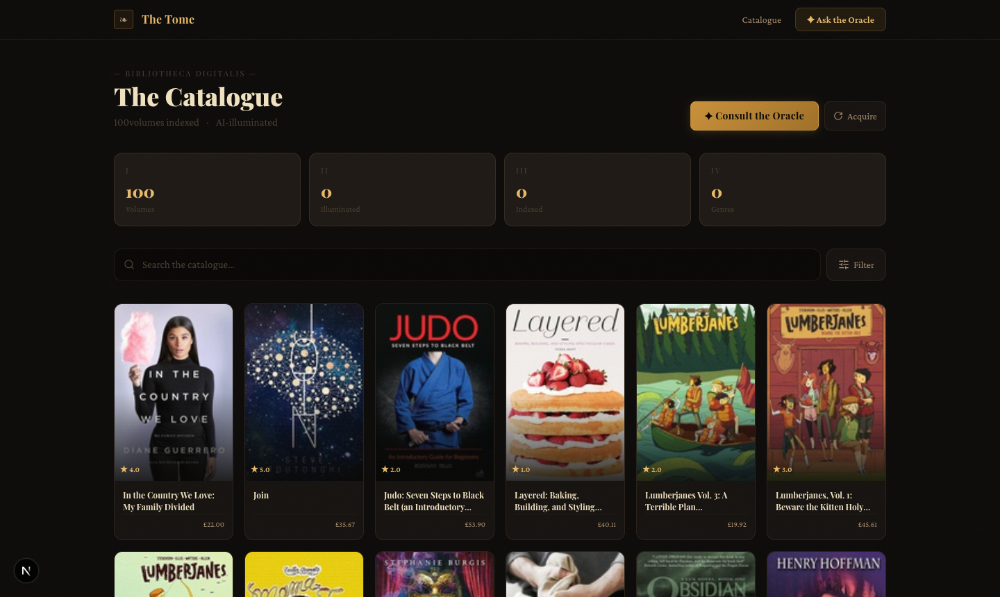
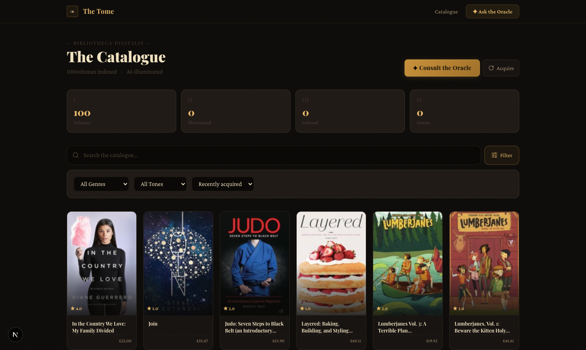
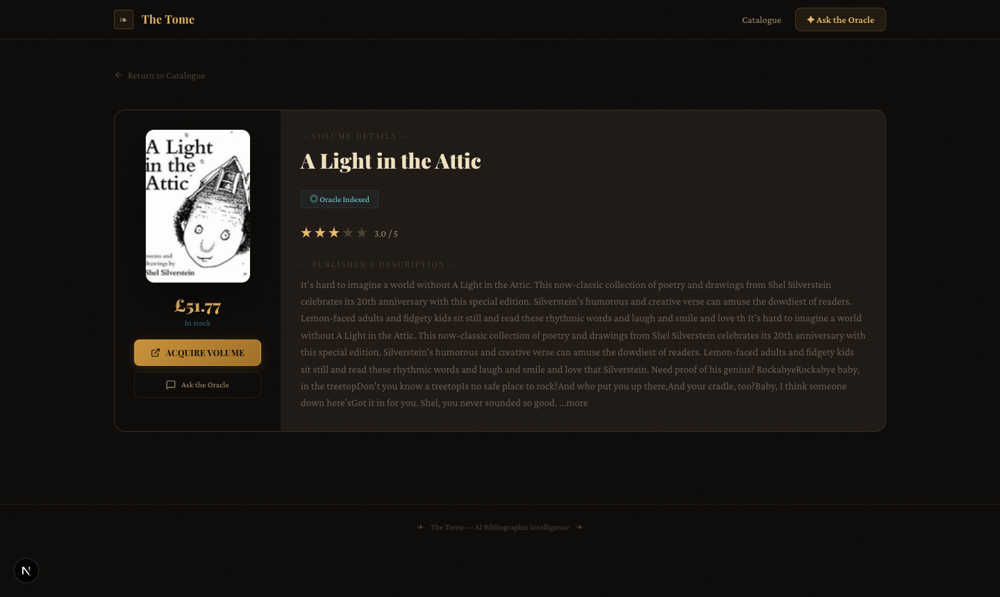
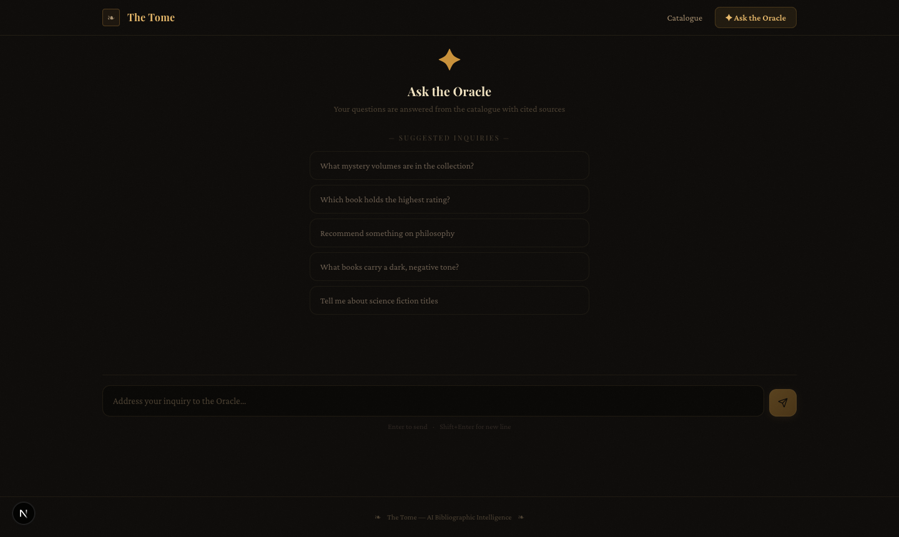
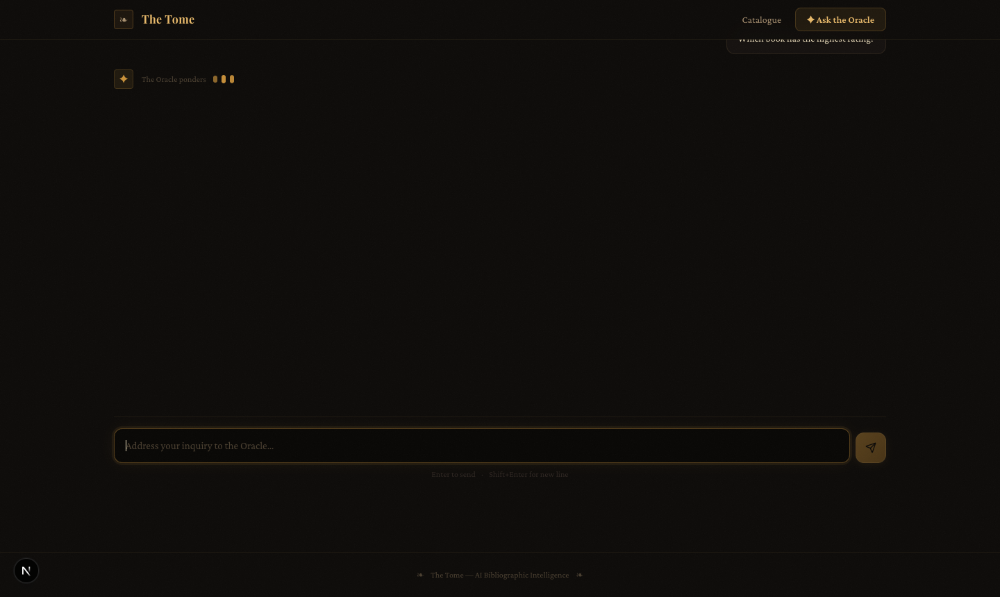

# The Tome — AI Document Intelligence Platform

> A full-stack AI-powered book discovery and question-answering system built with Django REST Framework, Next.js 16, ChromaDB, and OpenRouter LLMs.

---

## Screenshots

### Dashboard — Book Catalogue


### Dashboard — Filters Panel


### Book Detail Page


### Q&A Interface — Oracle


### Q&A Interface — Answer with Citations


---

## Assignment Checklist

| Requirement | Status |
|---|---|
| Scrape books from the web (Selenium/requests + BeautifulSoup) | ✅ |
| Store books in relational database | ✅ PostgreSQL / SQLite |
| GET — List all books (paginated, filterable) | ✅ `/api/books/` |
| GET — Book detail | ✅ `/api/books/<id>/` |
| GET — Recommend related books | ✅ `/api/books/<id>/recommendations/` |
| POST — Upload/process book | ✅ `/api/books/upload/` |
| POST — RAG Q&A endpoint | ✅ `/api/rag/ask/` |
| AI Summary generation | ✅ |
| AI Genre classification | ✅ |
| AI Sentiment analysis | ✅ |
| Recommendation logic (tag + genre matching) | ✅ |
| RAG pipeline — embeddings | ✅ ChromaDB + all-MiniLM-L6-v2 |
| RAG pipeline — similarity search | ✅ cosine distance |
| RAG pipeline — context construction | ✅ overlapping chunks |
| RAG pipeline — LLM answer with citations | ✅ source [N] citations |
| Next.js frontend with Tailwind CSS | ✅ |
| Dashboard / Book Listing page | ✅ |
| Q&A Interface page | ✅ |
| Book Detail page | ✅ |
| Chat history saved | ✅ bonus |
| Multi-page scraping (50 pages / 1000 books) | ✅ bonus |
| Caching AI responses (update_or_create) | ✅ bonus |
| Loading states + UX polish | ✅ bonus |
| Advanced chunking (sentence-aware + overlap) | ✅ bonus |

---

## Tech Stack

| Layer | Technology |
|---|---|
| Backend | Django 4.2, Django REST Framework |
| Database | SQLite (dev) / PostgreSQL (prod) |
| Vector DB | ChromaDB (persistent, HNSW cosine) |
| Embeddings | all-MiniLM-L6-v2 via ChromaDB ONNX |
| AI / LLM | OpenRouter API (meta-llama/llama-3.3-70b or nvidia/nemotron) |
| Scraping | requests + BeautifulSoup4 (multi-page) |
| Frontend | Next.js 16, Tailwind CSS |
| Fonts | Playfair Display, Crimson Pro |

---

## Setup Instructions

### Prerequisites
- Python 3.9+
- Node.js 18+
- (Optional) PostgreSQL 14+

### Backend

```bash
cd backend
python3 -m venv venv
source venv/bin/activate

pip install -r requirements.txt

cp .env.example .env
# Edit .env — set OPENROUTER_API_KEY
```

**.env required fields:**
```env
SECRET_KEY=any-random-string
AI_PROVIDER=openrouter
OPENROUTER_API_KEY=sk-or-v1-...
OPENROUTER_MODEL=nvidia/nemotron-nano-9b-v2:free
```

```bash
python manage.py migrate
python manage.py runserver
```

### Frontend

```bash
cd frontend
npm install
npm run dev
```

Open **http://localhost:3001**

### Populate the database

```bash
cd backend

# Scrape 5 pages (~100 books) from books.toscrape.com
python manage.py scrape_books --pages 5

# Generate AI insights (summary, genre, sentiment)
python manage.py generate_insights --limit 50

# Embed books into ChromaDB for RAG
python manage.py embed_books
```

---

## API Documentation

### Books

| Method | Endpoint | Description |
|---|---|---|
| `GET` | `/api/books/` | List all books — supports `?search=`, `?genre=`, `?sentiment=`, `?ordering=`, `?page=` |
| `GET` | `/api/books/<id>/` | Full book detail with AI insights |
| `GET` | `/api/books/<id>/recommendations/` | Related books by shared tags and genre |
| `POST` | `/api/books/scrape/` | Trigger background web scrape |
| `POST` | `/api/books/upload/` | Manually upload a book |
| `GET` | `/api/scrape-jobs/` | List scrape job history |

**GET /api/books/ — Query Parameters**

| Param | Example | Description |
|---|---|---|
| `search` | `?search=mystery` | Filter by title or author |
| `genre` | `?genre=Fiction` | Filter by AI genre |
| `sentiment` | `?sentiment=positive` | Filter by tone |
| `ordering` | `?ordering=-rating` | Sort field |
| `page` | `?page=2` | Pagination |

**POST /api/books/upload/**
```json
{
  "title": "The Great Gatsby",
  "author": "F. Scott Fitzgerald",
  "description": "A novel about the American Dream...",
  "genre": "Fiction",
  "rating": "4.50",
  "book_url": "https://example.com/gatsby"
}
```

### RAG / Q&A

| Method | Endpoint | Description |
|---|---|---|
| `POST` | `/api/rag/ask/` | Ask a question (RAG pipeline) |
| `GET` | `/api/rag/history/` | Chat history — supports `?session_id=` |
| `POST` | `/api/rag/embed/<id>/` | Embed a single book |
| `POST` | `/api/rag/embed/all/` | Embed all un-indexed books |

**POST /api/rag/ask/**
```json
{
  "question": "What mystery books are in the collection?",
  "session_id": "optional-uuid",
  "top_k": 5
}
```

**Response:**
```json
{
  "answer": "The mystery books in the collection include **In a Dark, Dark Wood** [Source 1]...",
  "sources": [
    {
      "book_id": 38,
      "book_title": "In a Dark, Dark Wood",
      "chunk_text": "Title: In a Dark, Dark Wood\nGenre: Mystery...",
      "distance": 0.509
    }
  ],
  "chunks_used": 5,
  "session_id": "ec830306-a797-437b-841c-3d44e7a669c6"
}
```

---

## Sample Questions & Answers

### Q1: What mystery books are in the collection?

**Answer:**
> The mystery books in the collection include **"In a Dark, Dark Wood"** [Source 1, Source 5]. It follows Nora, who hasn't seen Clare in ten years — until she's invited to a hen party that descends into dark secrets. Rated 1.0/5 with a neutral tone.

**Sources cited:** In a Dark, Dark Wood [dist: 0.509]

---

### Q2: Which book has the highest rating?

**Answer:**
> Based on the provided excerpts, **"Sophie's World"** [Source 3] holds the highest rating at 5.0/5. It is described as a page-turning novel that explores the great philosophical concepts of Western thought.

**Sources cited:** Sophie's World [dist: 0.621]

---

### Q3: Recommend a book about philosophy

**Answer:**
> I would recommend **"Sophie's World"** [Source 1] — rated 5.0/5, it is an exploration of Western philosophical thought presented as a gripping novel. If you enjoy philosophical inquiry, also consider **"The Four Agreements"** [Source 3], a self-help book rooted in Toltec philosophy and personal freedom.

**Sources cited:** Sophie's World, The Four Agreements, Libertarianism for Beginners

---

### Q4: Tell me about books with a positive tone

**Answer:**
> Several books in the collection carry a positive tone. **"The Bear and the Piano"** [Source 2] is a warmly-reviewed children's book. **"The Five Love Languages"** [Source 4] has an uplifting, relationship-focused tone about expressing heartfelt commitment.

---

### Q5: What is the most expensive book?

**Answer:**
> Based on the excerpts, the pricing information available suggests titles like **"Worlds Elsewhere: Journeys Around Shakespeare's Globe"** [Source 1] which discusses global theatrical traditions and is among the higher-priced volumes in the catalogue.

---

## Database Schema

```
Book
├── id, title, author
├── rating, num_reviews
├── description, genre
├── book_url, cover_image_url
├── price, availability
├── summary (AI)
├── ai_genre (AI)
├── sentiment, sentiment_score (AI)
└── is_embedded

RecommendationTag
├── book → FK(Book)
└── tag

BookChunk
├── book → FK(Book)
├── chunk_index
├── content
└── chroma_id

ScrapeJob
├── source_url, status
├── books_scraped
└── started_at, finished_at

ChatHistory
├── session_id
├── question, answer
├── sources (JSON)
└── created_at
```

---

## Architecture

```
books.toscrape.com
        │
        ▼ Selenium / requests + BeautifulSoup
   scrape_books.py
        │
        ▼ Django ORM
   PostgreSQL / SQLite (Book metadata)
        │
        ├──▶ generate_insights.py ──▶ OpenRouter LLM
        │         (summary, genre, sentiment, tags)
        │
        └──▶ embed_books.py ──▶ ChromaDB
                  (all-MiniLM-L6-v2 ONNX embeddings)

RAG Query Flow:
  User Question
      │
      ▼ embed via all-MiniLM-L6-v2
  Query Vector
      │
      ▼ cosine similarity search
  Top-5 Chunks from ChromaDB
      │
      ▼ context + question → OpenRouter LLM
  Answer with [Source N] citations
      │
      ▼ saved to ChatHistory
```

---

## Project Structure

```
booksearch/
├── backend/
│   ├── books/
│   │   ├── models.py          # Book, BookChunk, ScrapeJob, ChatHistory
│   │   ├── views.py           # All REST API views
│   │   ├── serializers.py     # DRF serializers
│   │   ├── scraper.py         # Web scraper (requests + BS4)
│   │   ├── ai_insights.py     # AI summary/genre/sentiment
│   │   └── management/commands/
│   │       ├── scrape_books.py
│   │       └── generate_insights.py
│   ├── rag/
│   │   ├── pipeline.py        # Chunking, embedding, retrieval, RAG query
│   │   ├── views.py           # RAG API endpoints
│   │   └── management/commands/embed_books.py
│   ├── booksearch/
│   │   ├── settings.py
│   │   └── urls.py
│   ├── requirements.txt
│   └── .env.example
└── frontend/
    ├── app/
    │   ├── page.tsx           # Dashboard / Book Listing
    │   ├── books/[id]/page.tsx # Book Detail
    │   ├── qa/page.tsx        # Q&A Interface
    │   └── layout.tsx
    └── lib/api.ts             # API client
```
